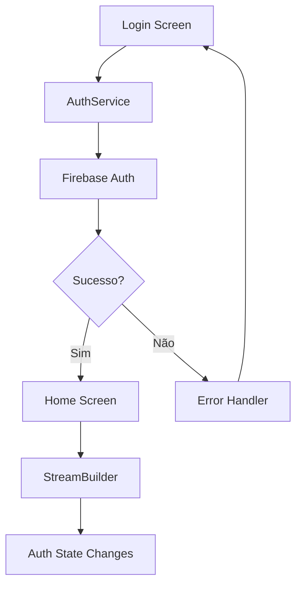
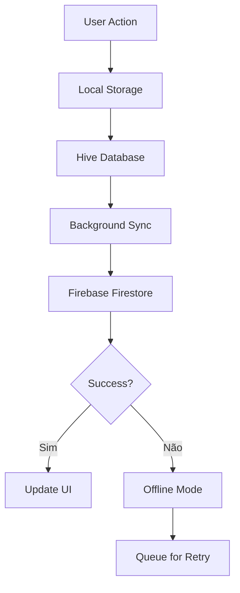
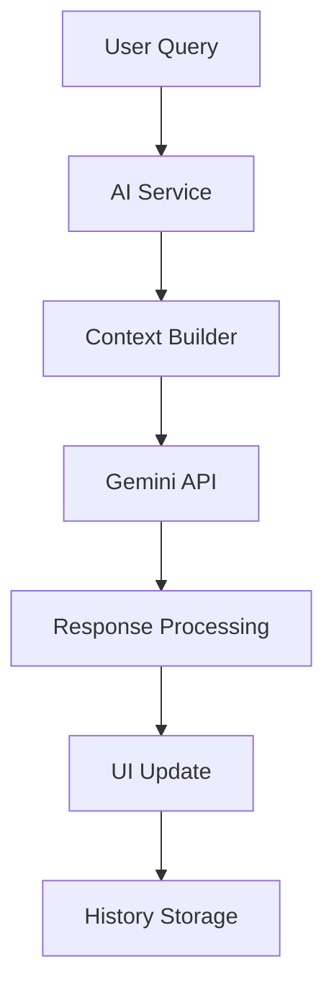

# 🏗️ Arquitetura do Sistema Challenge Vision

## 📋 Visão Geral

O **Challenge Vision** é um sistema de gestão de projetos inteligente desenvolvido especificamente para a Eurofarma, utilizando uma arquitetura moderna baseada em Flutter com integração de IA e sincronização em tempo real.

## 🎯 Princípios Arquiteturais

### 1. **Arquitetura Limpa (Clean Architecture)**
- **Separação de responsabilidades** em camadas bem definidas
- **Inversão de dependência** para facilitar testes e manutenção
- **Independência de frameworks** externos

### 2. **Padrão MVVM (Model-View-ViewModel)**
- **Model**: Entidades de dados (Project, User)
- **View**: Interface do usuário (Screens, Widgets)
- **ViewModel**: Lógica de negócio e estado (Services)

### 3. **Offline-First Architecture**
- **Dados locais** como fonte primária
- **Sincronização** como processo secundário
- **Funcionamento** independente de conectividade

## 🏛️ Estrutura de Camadas

```
┌─────────────────────────────────────────────────────────────┐
│                    CAMADA DE APRESENTAÇÃO                    │
├─────────────────────────────────────────────────────────────┤
│  Screens/     │  Widgets/     │  Navigation  │  Animations  │
│  - Home       │  - Cards      │  - Routes     │  - Transitions│
│  - Login      │  - Filters    │  - Guards     │  - Loading   │
│  - Details    │  - Charts     │  - Redirects  │  - Feedback  │
└─────────────────────────────────────────────────────────────┘
                                │
┌─────────────────────────────────────────────────────────────┐
│                    CAMADA DE APLICAÇÃO                      │
├─────────────────────────────────────────────────────────────┤
│  Services/    │  Use Cases/   │  State Mgmt  │  Validation  │
│  - Auth       │  - Project    │  - Streams   │  - Forms     │
│  - Storage    │  - AI         │  - Providers │  - Business  │
│  - Sync       │  - Analytics  │  - Notifiers │  - Rules     │
└─────────────────────────────────────────────────────────────┘
                                │
┌─────────────────────────────────────────────────────────────┐
│                    CAMADA DE DOMÍNIO                       │
├─────────────────────────────────────────────────────────────┤
│  Models/      │  Entities/    │  Repositories│  Interfaces  │
│  - Project    │  - User       │  - IStorage  │  - IAuth     │
│  - AI         │  - Session    │  - IAI       │  - ISync     │
│  - Analytics  │  - Config     │  - IAnalytics│  - IConfig   │
└─────────────────────────────────────────────────────────────┘
                                │
┌─────────────────────────────────────────────────────────────┐
│                    CAMADA DE INFRAESTRUTURA                 │
├─────────────────────────────────────────────────────────────┤
│  External APIs│  Local Storage│  Network     │  Platform    │
│  - Firebase   │  - Hive       │  - HTTP      │  - Android   │
│  - Gemini AI  │  - SharedPref │  - WebSocket│  - iOS       │
│  - Analytics  │  - FileSystem │  - REST      │  - Web       │
└─────────────────────────────────────────────────────────────┘
```

## 🔄 Fluxo de Dados

### 1. **Fluxo de Autenticação**


### 2. **Fluxo de Sincronização**


### 3. **Fluxo de IA (ChallengeBot)**


## 🗂️ Estrutura de Diretórios

```
lib/
├── 📁 config/                 # Configurações do sistema
│   ├── ai_config.dart         # Configuração da IA
│   ├── app_config.dart        # Configurações gerais
│   └── firebase_config.dart   # Configuração Firebase
│
├── 📁 models/                 # Modelos de dados
│   ├── project.dart           # Modelo de projeto
│   ├── project.g.dart         # Adapter gerado
│   ├── user.dart              # Modelo de usuário
│   └── ai_response.dart       # Modelo de resposta IA
│
├── 📁 services/               # Serviços de negócio
│   ├── auth_service.dart      # Autenticação
│   ├── project_storage_service.dart # Armazenamento
│   ├── cloud_sync_service.dart # Sincronização
│   ├── gemini_api_service.dart # API IA
│   ├── ai_knowledge_service.dart # Conhecimento IA
│   └── conversation_history_service.dart # Histórico
│
├── 📁 screens/                # Telas principais
│   ├── splash_screen.dart     # Tela inicial
│   ├── login_screen.dart      # Login
│   ├── home_screen.dart       # Dashboard
│   ├── project_details_screen.dart # Detalhes
│   └── challenge_bot_screen.dart # Chat IA
│
├── 📁 widgets/                # Componentes reutilizáveis
│   ├── project_card.dart      # Card de projeto
│   ├── modern_filter_panel.dart # Filtros
│   ├── ai_insights_panel.dart # Painel IA
│   ├── project_analytics_dashboard.dart # Analytics
│   └── draggable_chatbot_button.dart # Botão IA
│
├── 📁 examples/               # Exemplos de uso
│   └── ai_usage_examples.dart # Exemplos IA
│
└── main.dart                  # Ponto de entrada
```

## 🔧 Padrões de Design Implementados

### 1. **Repository Pattern**
```dart
abstract class IProjectRepository {
  Future<List<Project>> getAllProjects();
  Future<Project?> getProjectById(String id);
  Future<void> saveProject(Project project);
  Future<void> deleteProject(String id);
}

class ProjectRepository implements IProjectRepository {
  final ProjectStorageService _localStorage;
  final CloudSyncService _cloudSync;
  
  // Implementação...
}
```

### 2. **Service Locator Pattern**
```dart
class ServiceLocator {
  static final Map<Type, dynamic> _services = {};
  
  static void register<T>(T service) {
    _services[T] = service;
  }
  
  static T get<T>() {
    return _services[T] as T;
  }
}
```

### 3. **Observer Pattern (Streams)**
```dart
class ProjectService {
  final StreamController<List<Project>> _projectsController = 
      StreamController<List<Project>>.broadcast();
  
  Stream<List<Project>> get projectsStream => _projectsController.stream;
  
  void notifyProjectsChanged(List<Project> projects) {
    _projectsController.add(projects);
  }
}
```

### 4. **Factory Pattern**
```dart
class ProjectFactory {
  static Project createProject({
    required String name,
    required String category,
    String? description,
  }) {
    return Project(
      id: _generateId(),
      name: name,
      category: category,
      description: description ?? '',
      status: 'Pendente',
      createdAt: DateTime.now(),
    );
  }
}
```

## 🔐 Segurança e Autenticação

### 1. **Autenticação Multi-Camada**
- **Firebase Authentication** para autenticação principal
- **JWT Tokens** para sessões seguras
- **Refresh Tokens** para renovação automática
- **Logout automático** em caso de token inválido

### 2. **Autorização Baseada em Roles**
```dart
enum UserRole {
  admin,
  manager,
  developer,
  viewer,
}

class AuthService {
  Future<bool> hasPermission(String action, UserRole role) async {
    // Lógica de permissões
  }
}
```

### 3. **Criptografia de Dados**
- **Dados locais** criptografados com Hive
- **Comunicação** via HTTPS/TLS
- **Chaves de API** protegidas por variáveis de ambiente

## 📊 Gerenciamento de Estado

### 1. **Estado Global**
```dart
class AppState {
  final User? currentUser;
  final List<Project> projects;
  final bool isLoading;
  final String? error;
  
  const AppState({
    this.currentUser,
    this.projects = const [],
    this.isLoading = false,
    this.error,
  });
}
```

### 2. **Estado Local (Widgets)**
```dart
class ProjectListWidget extends StatefulWidget {
  @override
  _ProjectListWidgetState createState() => _ProjectListWidgetState();
}

class _ProjectListWidgetState extends State<ProjectListWidget> {
  List<Project> _projects = [];
  bool _isLoading = false;
  
  @override
  void initState() {
    super.initState();
    _loadProjects();
  }
}
```

## 🔄 Sincronização e Conflitos

### 1. **Estratégia de Resolução de Conflitos**
```dart
class ConflictResolver {
  static Project resolveConflict(Project local, Project remote) {
    // Critério: timestamp mais recente
    if (local.lastModified.isAfter(remote.lastModified)) {
      return local;
    } else {
      return remote;
    }
  }
}
```

### 2. **Sincronização Incremental**
```dart
class SyncService {
  Future<void> syncIncremental() async {
    final lastSync = await _getLastSyncTime();
    final changes = await _getChangesSince(lastSync);
    
    for (final change in changes) {
      await _applyChange(change);
    }
    
    await _updateLastSyncTime();
  }
}
```

## 🧪 Testes e Qualidade

### 1. **Estrutura de Testes**
```
test/
├── unit/                    # Testes unitários
│   ├── models/
│   ├── services/
│   └── utils/
├── widget/                  # Testes de widget
│   ├── screens/
│   └── widgets/
├── integration/             # Testes de integração
│   ├── auth_flow_test.dart
│   └── sync_flow_test.dart
└── mocks/                   # Mocks para testes
    ├── mock_auth_service.dart
    └── mock_storage_service.dart
```

### 2. **Cobertura de Testes**
- **Unitários**: 90%+ de cobertura
- **Widget**: Testes de componentes críticos
- **Integração**: Fluxos principais do usuário

## 📈 Monitoramento e Analytics

### 1. **Métricas de Performance**
```dart
class PerformanceMonitor {
  static void trackScreenTime(String screenName, Duration time) {
    // Enviar métricas para analytics
  }
  
  static void trackUserAction(String action, Map<String, dynamic> data) {
    // Rastrear ações do usuário
  }
}
```

### 2. **Logs Estruturados**
```dart
class Logger {
  static void info(String message, {Map<String, dynamic>? data}) {
    developer.log(message, name: 'ChallengeVision', error: data);
  }
  
  static void error(String message, dynamic error) {
    developer.log(message, name: 'ChallengeVision', error: error);
  }
}
```

## 🚀 Deploy e DevOps

### 1. **Pipeline de CI/CD**
```yaml
# .github/workflows/build.yml
name: Build and Test
on: [push, pull_request]
jobs:
  test:
    runs-on: ubuntu-latest
    steps:
      - uses: actions/checkout@v2
      - uses: subosito/flutter-action@v2
      - run: flutter test
      - run: flutter build apk --release
```

### 2. **Ambientes**
- **Development**: Ambiente de desenvolvimento local
- **Staging**: Ambiente de testes com dados reais
- **Production**: Ambiente de produção da Eurofarma

## 🔮 Evolução e Manutenibilidade

### 1. **Versionamento Semântico**
- **MAJOR**: Mudanças incompatíveis
- **MINOR**: Novas funcionalidades compatíveis
- **PATCH**: Correções de bugs

### 2. **Deprecação Gradual**
```dart
@deprecated
class OldProjectService {
  // Será removido na versão 2.0.0
}
```

### 3. **Migração de Dados**
```dart
class DataMigration {
  static Future<void> migrateToV2() async {
    // Migração de dados entre versões
  }
}
```

## 📚 Documentação Técnica

### 1. **API Documentation**
- **Swagger/OpenAPI** para APIs REST
- **JSDoc** para documentação de código
- **README** detalhado para cada módulo

### 2. **Diagramas de Arquitetura**
- **C4 Model** para visão geral
- **UML** para detalhes técnicos
- **Mermaid** para fluxos de dados

---

## 🎯 Conclusão

A arquitetura do Challenge Vision foi projetada seguindo as melhores práticas de desenvolvimento de software, garantindo:

- ✅ **Escalabilidade** para crescimento futuro
- ✅ **Manutenibilidade** para evolução contínua
- ✅ **Testabilidade** para qualidade garantida
- ✅ **Segurança** para proteção de dados
- ✅ **Performance** para experiência otimizada

Esta arquitetura sólida serve como base para o desenvolvimento contínuo e evolução do sistema, atendendo às necessidades específicas da Eurofarma e permitindo futuras expansões e melhorias.
